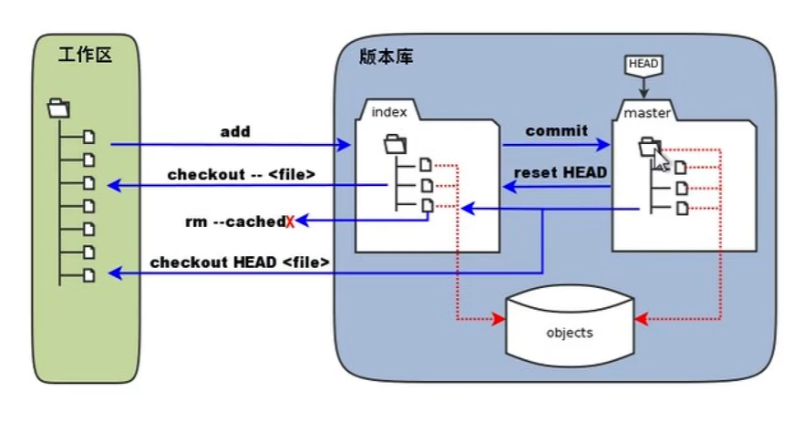

# manage git 

## structure:

work - index - git      ->github




## process:


#1,clone, if there’s some problems,check document on github （all in there）

```
git clone "ssh"
```

#2,make a new file :first

```
git add first

git commit  -m "explain"

git push
```


​	before it:  (make it known who did it )

```
		git config --global user.email
		git config --global user.name
```

#3,if wanna change:
	

```
 reset  head   # ->index
```

​	

```python
checkout --
rm --cached   (directly delete)
```
#4 else process:

```
git status
git log
git show head
```

